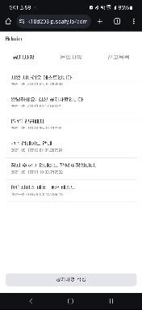
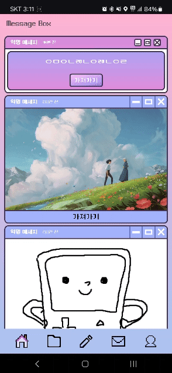

<p align="center">
  
</p>
<h1 align="center"> 우리들의 대나무 숲, whorU! </h1>
<p align="center" style="font-size: 20px">
<a href="https://www.notion.so/SSAFY-D203-32eaef8bd8f54a9c9a24584c406dc76a?pvs=4"> 📒Notion </a>
</p>

<h1> 🧷목차 </h1>
<ol>
  <li> <a herf="#section1"> 서비스 소개 </a> </li>
  <li> <a herf="#section2"> 팀원 구성 </a> </li>
  <li> <a herf="#section3"> 기술 스택 </a> </li>
  <li> <a herf="#section4"> 역할 분담 </a> </li>
  <li> <a herf="#section5"> 서비스 아키텍처 </a> </li>
  <li> <a herf="#section6"> 시연 시나리오 </a> </li>
  <li> <a herf="#section7"> 주요 기능 </a> </li>
</ol>

<br>

<h2 id="section1">👀 1. 서비스 소개 </h2>
<h3>📨 whorU란?</h3>
<br />
우리들의 대나무 숲 Whoru! 언제 사용하는게 좋을까요?
<br />
<li> 지금 내 감정을 누군가에게 전하고 싶어!
<li> 나만 가지고 있기엔 아까운 사진들!
<li> 내 목소리 어때?

<b>익명을 기반으로 랜덤한 대상에게 메시지를 보내보세요!

<br>
<br>

<p align="center" style="font-size: 20px">
<a href="https://k10d203.p.ssafy.io/"> whorU 서비스 바로 가기 </a>
</p>

<h2 id="section2"> 📎2. 팀원 구성 </h2>
<table>
 <tr>
    <td align="center"><a href="https://github.com/Be-HinD"></a></td>
    <td align="center"><a href="https://github.com/GEISHAz"></a></td>
    <td align="center"><a href="https://github.com/kimhaechang1"></a></td>
    <td align="center"><a href="https://github.com/RyuTa960625"></a></td>
   <td align="center"><a href="https://github.com/kangjungsuu"></a></td>
   <td align="center"><a href="https://github.com/nks211"></a></td>
  </tr>
  <tr>
    <td align="center"><a href="https://github.com/Be-HinD"><b>김정현</b></a><p>Back-End</p></td>
    <td align="center"><a href="https://github.com/GEISHAz"><b>정민호</b></a><p>Infra</p></td>
    <td align="center"><a href="https://github.com/kimhaechang1"><b>김회창</b></a><p>Back-End</p></td>
    <td align="center"><a href="https://github.com/RyuTa960625"><b>류태수</b></a><p>Front-End</p></td>
    <td align="center"><a href="https://github.com/kangjungsuu"><b>강정수</b></a><p>Front-End</p></td>
    <td align="center"><a href="https://github.com/nks211"><b>오승현</b></a><p>Front-End</p></td>
  </tr>
</table>

<br>

<br>
<h2 id="section3"> 🛠️ 3. 기술 스택 </h2>

<h3 align="center"> Back-End </h3>

<p align="center">
  
  
  #### Version
  ```
  Spring boot : 3.2.4
  JDK 21
  Gradle : 8.7
  JWT : 0.12.3
  MySQL : 8.3.0
  Redis : 7.2.4
  ```
</p>

<br>
<hr>

<h3 align="center"> Front-End </h3>

<p align="center">
  
</p>

#### Version

```
Node : 20.11.1
React : 18.2.0
Vite : 5.1.6
```

<br>
<hr>

<h3 align="center"> Infra </h3>

<p align="center">
  
</p>

#### Version

```
Docker : 26.0.2
Nginx : 1.25.5
```

<br>
<hr>

<h3 align="center"> Tools </h3>

<p align="center">
  
</p>

<br>

<h2 id="section4">👪 4. 역할 분담 </h2>
<h3> 😁 김정현 </h3>
<ul>
  <li> 메트릭 모니터링 환경 구축
  <li> WAS Log 수집 및 모니터링 환경 구축
  <li> 수집 컨텐츠 개발
  <li> 사용자 신고 로직 개발
  <li> 개발 서버 환경 구축 및 운용
</ul>

<hr>
<h3> 😇 정민호 </h3>
<ul>
  <li> FE, BE 브랜치 별 CI/CD 환경 구축
  <li> 카카오, 구글 소셜 로그인 구현
  <li> Spring Security 개발
  <li> 회원관리 API 개발
  <li> 최종 프로젝트 발표
</ul>

<hr>
<h3> 😌 김회창 </h3>
<ul>
  <li> 메세지 도메인 구현
  <li> 관리자 공지사항 도메인 구현
  <li> Firebase Cloud Message 푸시알림 백엔드 구현
</ul>

<hr>
<h3> 😎 류태수 </h3>
<ul>
  <li> 우편함 페이지
  <li> 데일리 메시지 페이지
  <li> 개인 메시지 페이지
  <li> 메시지 전송 페이지
</ul>

<hr>
<h3> 😊 강정수 </h3>
<ul>
  <li> 소셜 로그인
  <li> 회원 관리
  <li> 관리자 페이지
</ul>

<hr>
<h3> 🤓 오승현 </h3>
<ul>
  <li> 마이페이지 디자인
  <li> 수집 컨텐츠
</ul>

<hr>

<br>

<h2 id="section5">⚙️ 6. 서비스 아키텍처 </h2>


<br>

<h2 id="section6"> 🎥 7. 주요 기능</h2>

### 메시지 전송

- 텍스트, 이미지, 음성 3가지의 Media Type 지원
- 전송 시 30% 확률로 랜덤박스 획득
- 전송 시 랜덤 대상이 아닌 공통 우편함으로 전송

#### Text


<br/>

#### Image


<br/>

#### Text


<br/>

### 우편함

- 익명으로부터 전송된 메시지는 우편함에 저장
- 사용자는 우편함에서 해당하는 메시지를 가로챌 수 있음
- 가로채면 사용자의 메시지로 귀속되며, 1회에 한해서 답장 가능


<br/>

### 관리자

- 관리자는 공지사항을 작성 및 수정할 수 있음
- 관리자는 문의사항들을 조회하고, 답글을 달 수 있음
- 관리자는 신고내역을 조회할 수 있고, 사용자 정지 처리를 할 수 있음



<br/>

### FCM

- 사용자는 백그라운드 및 포그라운드에서 FCM 알림을 수신할 수 있음



<br/>
