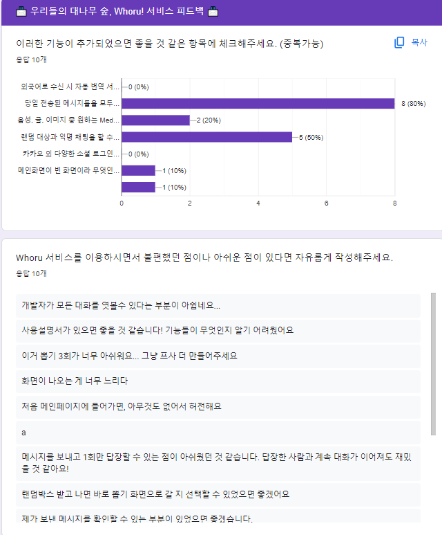
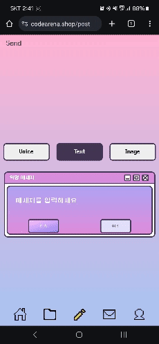
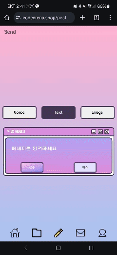
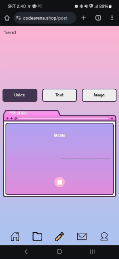
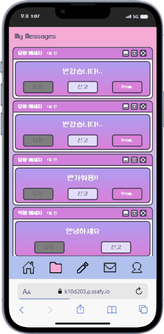
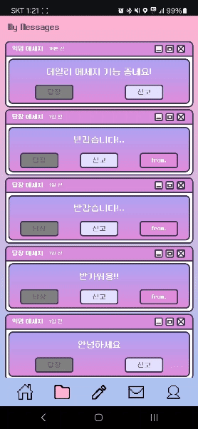
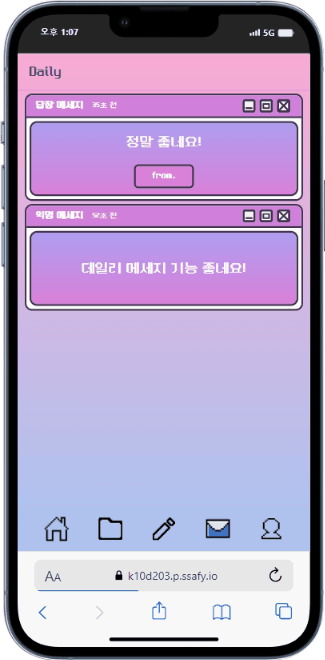
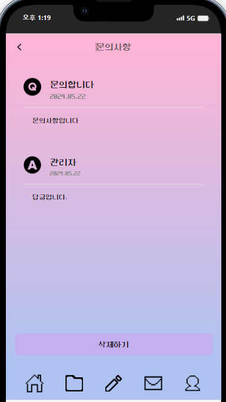
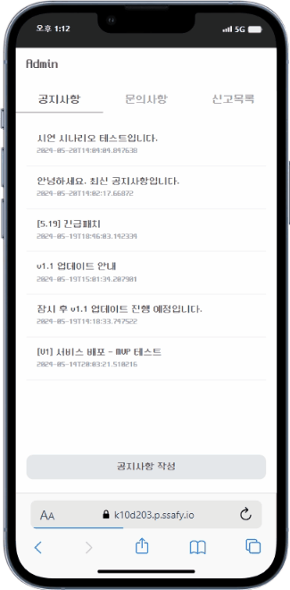
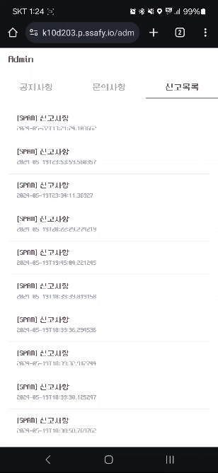

<p align="center">
  
</p>
<h1 align="center"> 우리들의 대나무 숲, whorU! </h1>
<p align="center" style="font-size: 20px">
<a href="https://www.notion.so/SSAFY-D203-32eaef8bd8f54a9c9a24584c406dc76a?pvs=4"> 📒Notion </a>
</p>

<h1> 🧷목차 </h1>
<ol>
  <li><a href="#section1" >서비스 소개 </a> </li>
  <li><a href="#section2" >프로젝트 목표 </a> </li>
  <li> <a href="#section2"> 팀원 구성 </a> </li>
  <li> <a href="#section4">  기술 스택 </a> </li>
  <li> <a href="#section5">  역할 분담 </a> </li>
  <li> <a href="#section6"> 서비스 아키텍처 </a> </li>
  <li> <a href="#section7">  1.1 패치 </a> </li>
  <li> <a href="#section8">  주요 기능 </a> </li>
</ol>

<br>

<h2 id="section1">👀 1. 서비스 소개 </h2>
<h3>📨 whorU란?</h3>
<br />
우리들의 대나무 숲 Whoru! 언제 사용하는게 좋을까요?
<br />
<li> 지금 내 감정을 누군가에게 전하고 싶어!
<li> 나만 가지고 있기엔 아까운 사진들!
<li> 내 목소리 어때?

<b>익명을 기반으로 랜덤한 대상에게 메시지를 보내보세요!</b>

<br>
<br>

<p align="center" style="font-size: 20px">
<a href="https://k10d203.p.ssafy.io/"> whorU 서비스 바로 가기 </a>
</p>

<br>
<br>

<h2 id="section2">2. 프로젝트 목표</h2>

whorU 프로젝트는 **운영적인 측면**을 고려하여 개발하는것과

사용자들로부터의 **실제 피드백을 기반으로 1.1 패치**를 진행하는 것을 목표로 진행하였습니다.

따라서 운영적인 측면에서는 개발자들이 쉽게 이슈에 대응하기 위해 **로깅, 모니터링 툴**을 사용하였고

**개발 서버 EC2 와 운영 서버 EC2를 최대한 동일한 환경으로 구축**하여

다음 버전 업데이트에 호환성 문제없이 진행할 수 있었습니다.

피드백은 아래와 같은 구글설문을 통해 진행하였습니다.



<br>
<br>

<h2 id="section3"> 📎3. 팀원 구성 </h2>
<table>
 <tr>
    <td align="center"><a href="https://github.com/Be-HinD"></a></td>
    <td align="center"><a href="https://github.com/GEISHAz"></a></td>
    <td align="center"><a href="https://github.com/kimhaechang1"></a></td>
    <td align="center"><a href="https://github.com/RyuTa960625"></a></td>
   <td align="center"><a href="https://github.com/kangjungsuu"></a></td>
   <td align="center"><a href="https://github.com/nks211"></a></td>
  </tr>
  <tr>
    <td align="center"><a href="https://github.com/Be-HinD"><b>김정현</b></a><p>Back-End</p></td>
    <td align="center"><a href="https://github.com/GEISHAz"><b>정민호</b></a><p>Infra</p></td>
    <td align="center"><a href="https://github.com/kimhaechang1"><b>김회창</b></a><p>Back-End</p></td>
    <td align="center"><a href="https://github.com/RyuTa960625"><b>류태수</b></a><p>Front-End</p></td>
    <td align="center"><a href="https://github.com/kangjungsuu"><b>강정수</b></a><p>Front-End</p></td>
    <td align="center"><a href="https://github.com/nks211"><b>오승현</b></a><p>Front-End</p></td>
  </tr>
</table>

<br>

<br>
<h2 id="section4"> 🛠️ 4. 기술 스택 </h2>

<h3 align="center"> Back-End </h3>

<p align="center">
  
  
  #### Version
  ```
  Spring boot : 3.2.4
  JDK 21
  Gradle : 8.7
  JWT : 0.12.3
  MySQL : 8.3.0
  Redis : 7.2.4
  ```
</p>

<br>
<hr>

<h3 align="center"> Front-End </h3>

<p align="center">
  
</p>

#### Version

```
Node : 20.11.1
React : 18.2.0
Vite : 5.1.6
```

<br>
<hr>

<h3 align="center"> Infra </h3>

<p align="center">
  
</p>

#### Version

```
Docker : 26.0.2
Nginx : 1.25.5
```

<br>
<hr>

<h3 align="center"> Tools </h3>

<p align="center">
  
</p>

<br>

<h2 id="section5">👪 5. 역할 분담 </h2>
<h3> 😁 김정현 </h3>
<ul>
  <li> 메트릭 모니터링 환경 구축 </li>
  <li> WAS Log 수집 및 모니터링 환경 구축 </li>
  <li> 수집 컨텐츠 개발 </li>
  <li> 사용자 신고 로직 개발 </li>
  <li> 개발 서버 환경 구축 및 운용 </li>
</ul>

<hr>
<h3> 😇 정민호 </h3>
<ul>
  <li> FE, BE 브랜치 별 CI/CD 환경 구축
  <li> 카카오, 구글 소셜 로그인 구현
  <li> Spring Security 개발
  <li> 회원관리 API 개발
  <li> 최종 프로젝트 발표
</ul>

<hr>
<h3> 😌 김회창 </h3>
<ul>
  <li> 메세지 도메인 구현
  <li> 관리자 공지사항 도메인 구현
  <li> Firebase Cloud Message 푸시알림 백엔드 구현
</ul>

<hr>
<h3> 😎 류태수 </h3>
<ul>
  <li> 우편함 페이지
  <li> 데일리 메시지 페이지
  <li> 개인 메시지 페이지
  <li> 메시지 전송 페이지
</ul>

<hr>
<h3> 😊 강정수 </h3>
<ul>
  <li> 소셜 로그인
  <li> 회원 관리
  <li> 관리자 페이지
</ul>

<hr>
<h3> 🤓 오승현 </h3>
<ul>
  <li> 마이페이지 디자인
  <li> 수집 컨텐츠
</ul>

<hr>

<br>

<h2 id="section6">⚙️ 6. 서비스 아키텍처 </h2>


<br>

<h2 id="section7"> 7. 1.1 패치</h2>

기존의 1.0 ver 의 주요 사용자 기능들은 다음과 같았습니다.

- 메세지 랜덤발송 및 답장

  - 메세지 송신자를 제외한 랜덤한 1명에게 메세지를 전송하고 Firebase 알림을 보낸다.

  - 메세지를 받은 사람은 1회에 한해서 답장을 보낼 수 있다.


- 랜덤박스 기능

  - 하루 최대 3회, 메세지 전송시 얻을 수 있다.

  - 랜덤박스에서 등급에 따른 확률로 프로필 아이콘을 획득할 수 있다.

- 문의하기 기능

  - 문의하기 글을 등록하면 관리자가 답변을 달 수 있다.

- 프로필 서비스
  
  - 랜덤박스를 열어 볼 수 있으며, 획득한 아이콘 컬렉션을 열람할 수 있다.

  - 획득한 아이콘의 경우 프로필 아이콘 변경이 가능하다.

  - Firebase 알림 수신여부를 결정힐 수 있다.

이에 따라 1.0을 배포한 이후 **구글 설문** 및 **직접적인 소통**을 통해 피드백을 모았고

피드백을 요약하면 다음과 같습니다.

- 유저가 많으면 많을수록 답장을 받는데까지 시간이 오래걸린다.
  
- 메세지를 보내고 하루 3번 랜덤박스를 획득하고 나면 답장이 오기까지 컨텐츠가 없다.

- 랜덤박스 얻는횟수 3회 제한이 너무 적은것 같다.

- 답장메세지 수신시 어떤 메세지의 답장인지 알수 있으면 좋겠다.

- 알림 수신이 잘 안된다.

이에 따라 저희팀이 결정내린 1.1 패치사항은 아래와 같습니다.

<h4>유저의 컨텐츠를 늘리기 위한 패치</h4>

1. 메세지 전송 시스템에 **우편함** 시스템 패치

2. **데일리 메세지** 기능 패치

3. 랜덤박스 획득방법 변경

4. 답장 메세지일 때, 어떤 메세지의 답장인지 확인할 수 있는 모달 제공

<h4>편의성 패치</h4>

1. 모바일 환경에서 메세지를 쓰는 페이지에 진입시 키보드가 켜지는 문제 해결

<h4>주요 버그사항</h4>

1. IOS 환경에서 Firebase 알림이 설정되지 않는 문제 해결

<h2 id="section8"> 🎥 8. 주요 기능</h2>

### 메시지 전송 및 My Message

- 텍스트, 이미지, 음성 3가지의 Media Type 지원
- 전송 시 30% 확률로 랜덤박스 획득
- 전송 시 랜덤 대상이 아닌 공통 우편함으로 전송
- 우편함에서 가져온 메세지는 My Message에서 확인가능
- 답장 메세지의 경우 My Message에 보관되며, 어떤 메세지의 답장이었는지 from 버튼을 통해 모달로 확인가능
- My Message에서 메세지 신고 가능

|텍스트 메세지 전송|이미지 메세지 전송|음성 메세지 전송|
|:---:|:---:|:---:|
||||

|My Message|신고|
|:---:|:---:|
|||

<br/>

### 데일리 메세지

- 당일 날짜를 기준으로 00:00:00 ~ 23:59:59 사이의 메세지를 볼 수 있음

|데일리 메세지|
|:---:|
||

### 우편함

- 익명으로부터 전송된 메시지는 우편함에 저장
- 사용자는 우편함에서 해당하는 메시지를 가로챌 수 있음
- 가로채면 사용자의 메시지로 귀속되며, 1회에 한해서 답장 가능

|우편함|
|:---:|
||

<br/>

### 문의하기

- 사용자는 문의하기를 통해 관리자와 소통할 수 있음

|문의하기|관리자 답변 후|
|:---:|:---:|
|||

### 관리자

- 관리자는 공지사항을 작성 및 수정할 수 있음
- 관리자는 문의사항들을 조회하고, 답글을 달 수 있음
- 관리자는 신고내역을 조회할 수 있고, 사용자 정지 처리를 할 수 있음
- 공지사항 작성시 모든 회원에게 Firebase 푸시알림 발송

|공지사항|신고|문의사항|
|:---:|:---:|:---:|
||||


<br/>

### 푸시알림

- 사용자는 백그라운드 및 포그라운드에서 FCM 알림을 수신할 수 있음

|공지사항 백그라운드|공지사항 포그라운드|답장 백그라운드|답장 포그라운드|
|:---:|:---:|:---:|:---:|
|||||

<br/>
