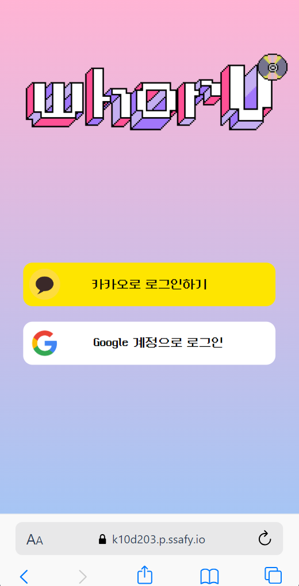
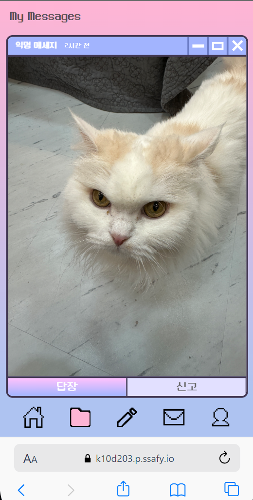
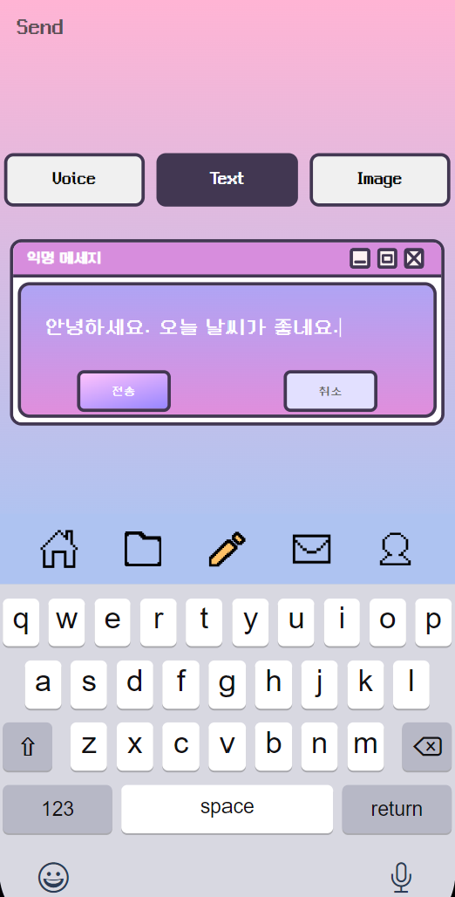
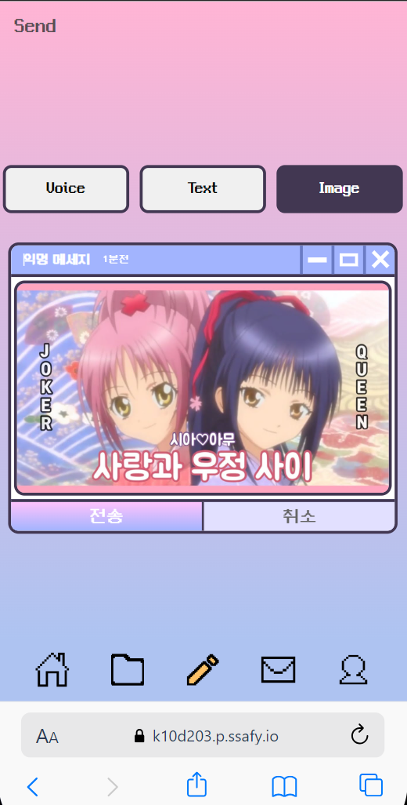
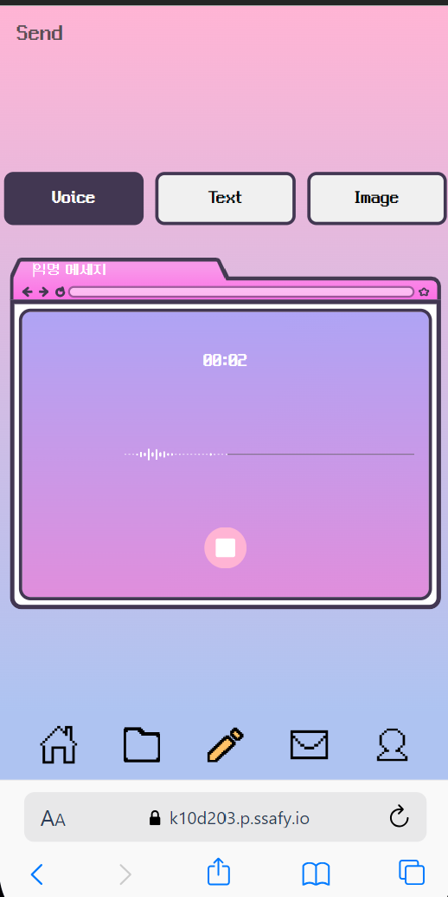
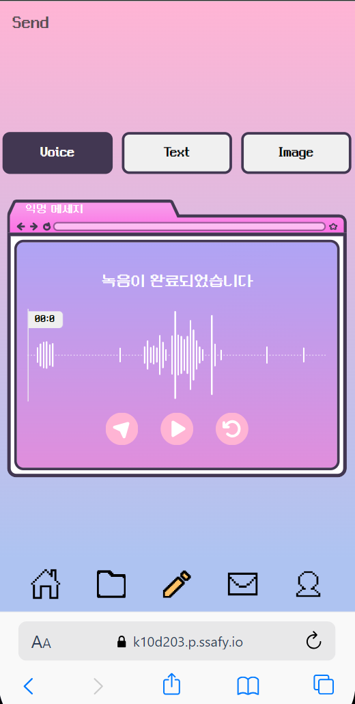
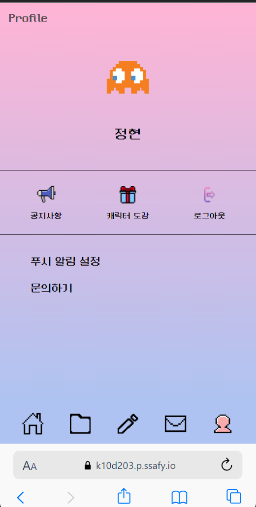

<h1> [whorU] 시연 시나리오 </h1>

<h2> 🧷목차 </h2>
<ol>
  <li> <a herf="#section1"> 소셜 로그인 </a> </li>
  <li> <a herf="#section2"> 메시지 가로채기 </a> </li>
  <li> <a herf="#section3"> 메시지 보내기 </a> </li>
  <li> <a herf="#section4"> 수집 컨텐츠 </a> </li>
  <li> <a herf="#section5"> 관리자 </a> </li>
  <li> <a herf="#section6"> FCM 알림 </a> </li>
</ol>

<h2 id="section1">👀 1. 소셜 로그인 </h2>

    
     
     
    <b> 사용자는 카카오, 구글 두 가지 소셜 로그인 기능을 이용할 수 있습니다.
     

<h2 id="section2">👀 2. 메시지 가로채기 </h2>

    
    
     
     
    <b> 사용자는 Message Box에서 최신순으로 도착한 메시지를 가로채서 My Message로 가져올 수 있습니다.
     

<h2 id="section3">👀 3. 메시지 보내기 </h2>

    
    

    
    

 
 
<b> 사용자는 텍스트, 이미지, 음성 3가지 Media Type을 통해서 메시지를 보낼 수 있습니다.
<b> 또한 사용자는 메시지 전송 시 30%의 확률로 랜덤박스를 획득할 수 있습니다.
 

<h2 id="section4">👀 4. 수집 컨텐츠 </h2>

    
    

    
    

 
 
<b> 사용자는 랜덤박스를 통해 캐릭터를 뽑을 수 있고, 가진 캐릭터를 통해 프로필을 변경할 수 있습니다.
 

<h2 id="section5">👀 5. 관리자 </h2>

    
    

    

 
 
<b> 관리자는 공지사항 내역을 볼 수 있고, 수정 및 작성이 가능합니다.
 
<b> 또한 문의사항 내역들을 확인 및 답변을 작성할 수 있고, 수정도 가능합니다.
 
<b> 마지막으로 신고목록들에 대해 조회 및 컨텐츠 확인 후 사용자 정지 처리를 할 수 있습니다.
 

<h2 id="section6">👀 6. FCM 알림 </h2>

    
    

    
    

 
 
<b> 사용자는 답장 및 공지사항에 대한 백그라운드 || 포그라운드 FCM 알림을 수신할 수 있습니다.
